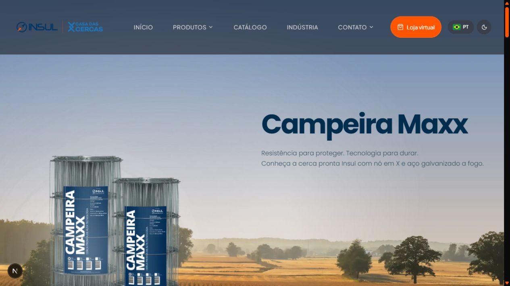
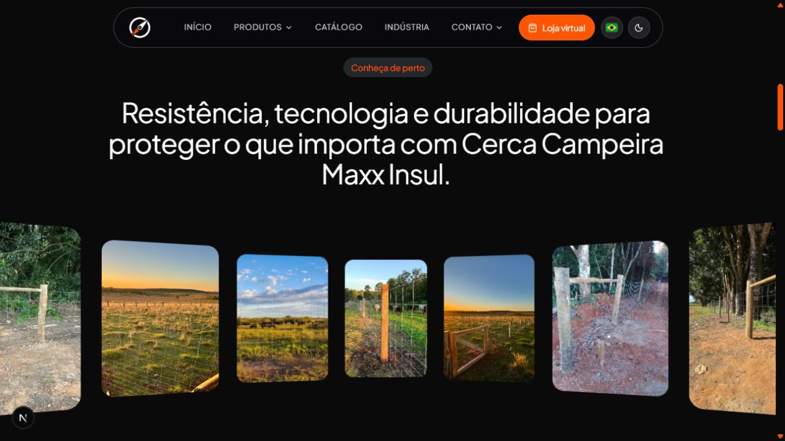
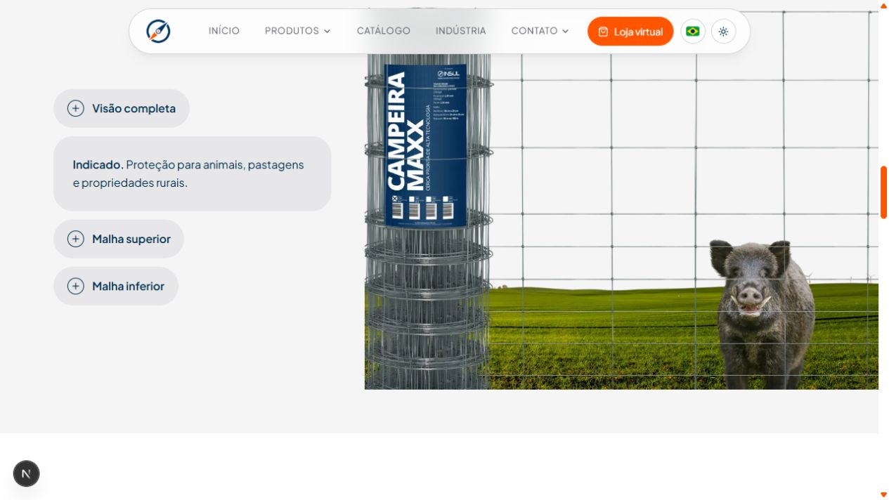
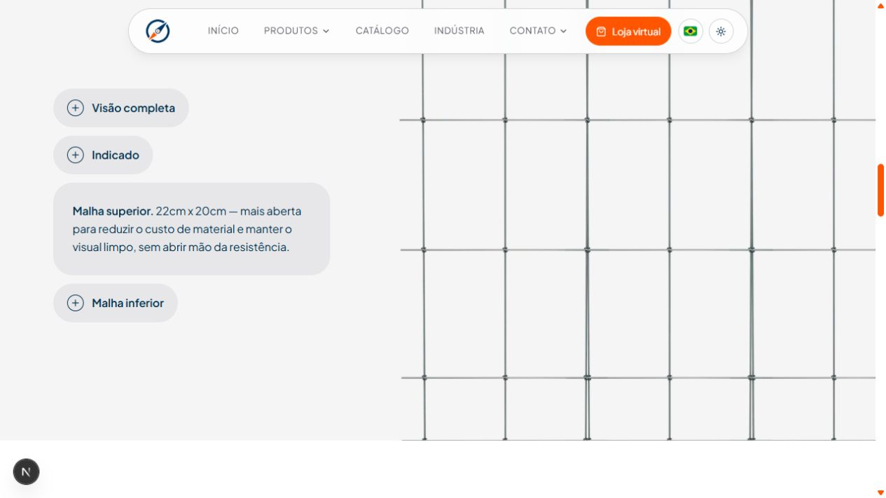
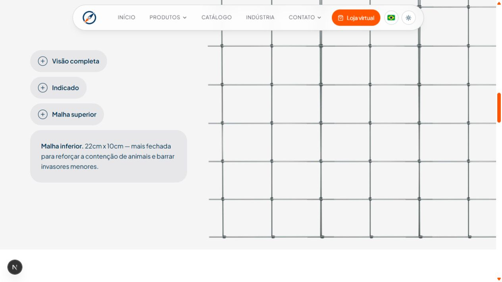
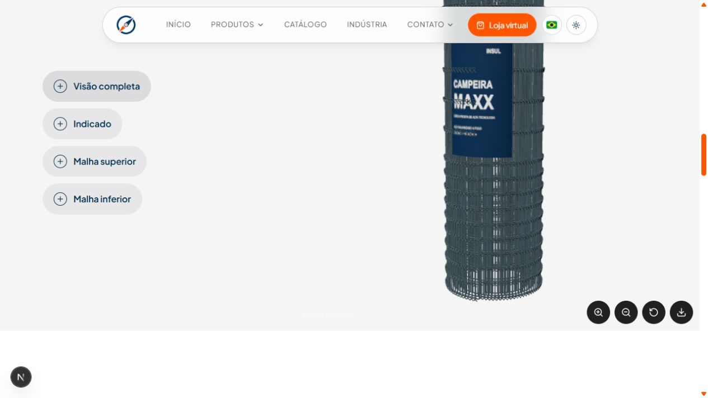
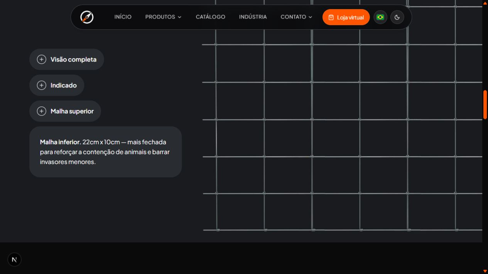

# Documentação das alterações — Campeira Maxx

Registro da nova apresentação da página da Campeira Maxx, desenvolvido a partir das referências e ajustes solicitados durante o trabalho.

**Data:** 16 de setembro de 2026  
**Página:** `/cercas-prontas/campeira-maxx`

## O que você definiu e preparou

- Escolheu uma apresentação com mais destaque para o produto, usando imagens no hero em lugar do vídeo.
- Indicou as referências da Apple para os detalhes interativos e do Bildora para o carrossel curvo.
- Forneceu e atualizou as imagens do hero, das malhas e da opção “Indicado”.
- Orientou os ajustes de zoom, blur, tamanho das imagens, textos, cores dos temas e disposição das seções.
- Pediu para preservar o componente anterior e manter a abertura da galeria em tela cheia.

## 1. Hero com imagens, entrada animada e parallax

A abertura da página apresenta os rolos de tela sobre uma paisagem. As imagens do produto surgem com uma transição suave ao entrar na página. Durante a rolagem, o cenário, os textos e o blur se deslocam para dar profundidade à composição.

O zoom dos produtos foi reduzido após o ajuste solicitado. O blur e o fundo acompanham o tema selecionado.

**Componente:** `app/components/CampeiraMaxxHero.tsx`  
**Imagens:** `public/images/hero-campeiraMaxx/`

## 2. Carrossel curvo com movimento automático

A apresentação anterior de especificações foi substituída por uma galeria inspirada no Bildora. Os cards mudam de posição, tamanho e inclinação ao percorrer a curva, criando a sensação de profundidade.

- As imagens passam automaticamente.
- O texto acima da galeria aparece progressivamente durante a rolagem.
- O fundo acompanha o tema claro ou escuro.
- O clique em uma imagem continua abrindo a visualização em tela cheia.
- O texto de instrução e as setas abaixo do carrossel foram removidos conforme solicitado.
- As imagens dos cards usam resolução e qualidade ajustadas para a apresentação.

O movimento pausa quando a seção está fora da tela, quando a aba está oculta, durante a interação e quando a visualização em tela cheia está aberta. A preferência por movimento reduzido também é respeitada.

**Componentes:** `app/components/PerspectiveGallery.tsx` e `app/components/ImgCarousel.tsx`

## 3. Apresentação interativa abaixo da galeria

Foi colocado abaixo do carrossel um componente de teste inspirado na apresentação de detalhes da Apple. O usuário escolhe uma opção à esquerda e vê o conteúdo correspondente à direita.

As opções atuais são:

1. **Visão completa:** modelo 3D do rolo de tela.
2. **Indicado:** imagem de aplicação do produto e descrição de uso.
3. **Malha superior:** imagem e descrição da malha superior.
4. **Malha inferior:** imagem e descrição da malha inferior.

Ao selecionar um detalhe, o botão se expande para apresentar o título e a descrição. A troca das imagens usa uma transição suave. Clicar novamente no detalhe selecionado retorna à visão completa.

**Componente:** `app/components/CampeiraMaxxShowcaseTeste.tsx`  
**Imagens:** `public/images/imagens-teste/`

### Indicado

A imagem usa ajuste para exibir a composição inteira, evitando o corte do rolo que havia sido observado.

### Malha superior

### Malha inferior

## 4. Modelo 3D da visão completa

Foi criado um modelo 3D ilustrativo do rolo da Campeira Maxx, com fios metálicos, malhas e etiqueta azul. O usuário pode arrastar para girar, aproximar, afastar, restaurar a visão e exportar o modelo em GLB pelos controles disponíveis.

O modelo é um protótipo visual baseado na referência fornecida. Não representa um arquivo técnico de fabricação ou uma reprodução exata da etiqueta original.

**Componente:** `app/components/CampeiraMaxxModel3D.tsx`  
**Tecnologia:** Three.js, com carregamento separado para a visualização 3D.

## 5. Fundo e adaptação aos temas

O fundo da apresentação interativa foi definido como **#f5f5f5 no tema claro** e **#191b1e no tema escuro**. Os botões, textos e estados de interação também mudam conforme o tema.

Essa área ocupa toda a largura disponível da seção. No desktop, a coluna dos controles tem 400 px e a imagem ocupa o espaço restante. A altura da área visual é o maior valor entre 680 px e 90% da altura visível da tela. No celular, os controles ficam acima da imagem, cuja proporção é 4:3. Portanto, o fundo não tem uma dimensão fixa única.

## Organização e preservação do código

| Arquivo | Responsabilidade |
| --- | --- |
| `app/pages/CercaProntaPage.tsx` | Organiza o hero, a galeria e o teste na página do produto. |
| `app/components/CampeiraMaxxHero.tsx` | Imagens, animação de entrada, parallax e blur do hero. |
| `app/components/PerspectiveGallery.tsx` | Curva dos cards, movimento automático e animação do texto. |
| `app/components/ImgCarousel.tsx` | Integração da galeria e abertura em tela cheia. |
| `app/components/CampeiraMaxxShowcaseTeste.tsx` | Opções, descrições, imagens e cores do teste. |
| `app/components/CampeiraMaxxModel3D.tsx` | Visualização e controles do modelo 3D. |

O hero anterior foi mantido como referência comentada na página, e seu componente foi preservado. O estilo das novas seções utiliza Tailwind. A galeria com perspectiva também foi integrada à página de telas soldadas e hexagonais.

## Como atualizar as imagens

- Para trocar o cenário ou os produtos do hero, atualize os arquivos em `public/images/hero-campeiraMaxx/` e confira os caminhos no componente do hero.
- Para trocar os detalhes, use `indicado.png`, `malha-superior.png` e `malha-inferior.png` em `public/images/imagens-teste/`.
- A opção “Indicado” exibe a imagem inteira. As malhas preenchem a área visual e podem perder bordas quando a proporção da imagem é diferente da área disponível.
- Os textos das malhas são obtidos dos dados de características do produto; a opção “Indicado” tem uma descrição padrão quando não existe um texto correspondente nos dados.

## Prints e verificação

Foram capturados oito prints da página local, mostrando o hero, a galeria, o modelo 3D, as três opções de imagens e os temas claro e escuro. Os arquivos originais estão na pasta `prints/`, junto desta documentação.

Os prints registram o aspecto visual no momento da captura. Os efeitos de rolagem, entrada e passagem automática devem ser vistos na própria página, pois uma imagem estática não mostra a animação.
